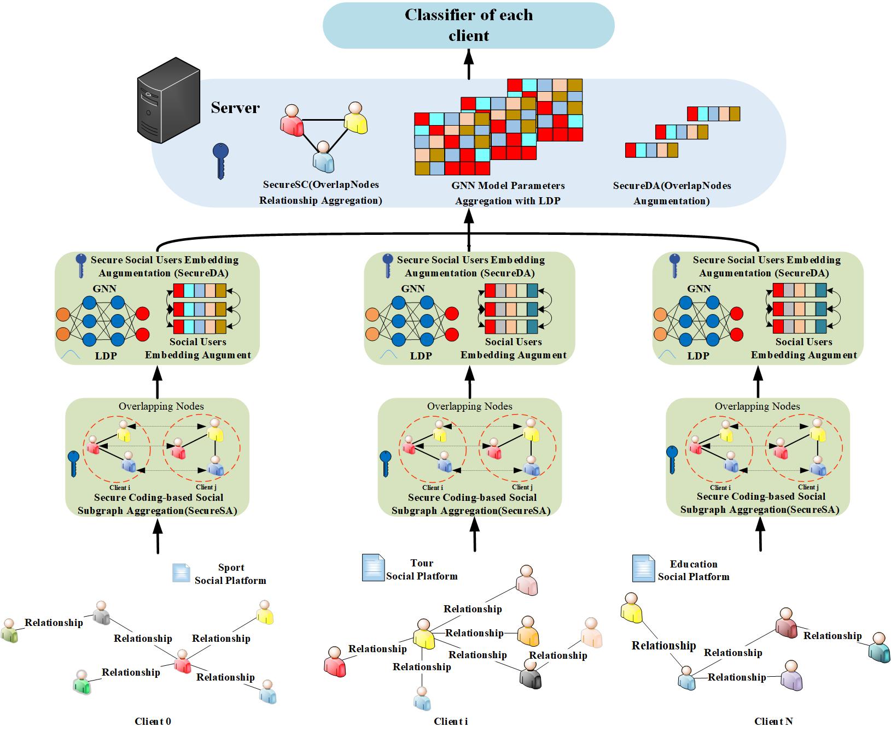

# PPFedGNN
Exploring the intrinsic value of social data has long been a focal point for researchers. Presently, diverse social network data is dispersed across various platforms. While federated learning enables collaborative training with multiple clients, enhancing model performance while safeguarding client-specific information, it often overlooks global user relationships and node-level semantic information, and still faces privacy breaches. Therefore, in order to address the above shortcomings, this study proposes an efficient privacy preserving federated graph neural network method (PPFedGNN) for social network analysis, thereby achieving dual guarantees of model performance and privacy security. To obtain global user relationships while protecting privacy, we designed a secure coding-based social subgraph aggregation method (SecureSA). This method improves model performance and algorithm efficiency by securely encoding and aggregating the node adjacency relationships accross different clients. Additionally, to capture richer global node-level semantic information, we developed a secure social node augumentation method (SecureNA) based on local differential privacy mechanism (LDP). This method enhances model performance while maintaining security by adding noise perturbation to important weights and integrating overlapped node embeddings from different clients. Through experimental verification, it has been found that on Facebook, Blogcatalog, Flickr and TeleComm datasets, the classification accuracy of PPFedGNN was 0.926, 0.838 0.662 and 0.898 respectively, outperforming other algorithms. Through ablation experiments, the effectiveness of the global user relationships and node augumentation has been further demonstrated. In addition, we also conducted a theoretical analysis of the security techniques used throughout the training process to demonstrate their safety and efficiency.

# Framework

# DataSet
The experimental dataset includes BlogCatalog[1], Flikr[1], Facebook[2] and TeleComm[3] datasets, you can download it yourself on the Internet.

# Experimental environment
+ torch == 2.2.2
+ pandas == 1.22.0
+ networkx == 3.1
+ matplotlib == 3.7.1
+ numpy == 1.22.0

# Reference
- [1] L. Tang and H. Liu, “Relational learning via latent social dimensions,” in Proceedings of the 15th ACM SIGKDD international conference on Knowledge discovery and data mining, 2009, pp. 817–826.
- [2] B. Viswanath, A. Mislove, M. Cha, and K. P. Gummadi, “On the evolution of user interaction in facebook,” in Proceedings of the 2nd ACM workshop on Online social networks, 2009, pp. 37–42.
- [3] https://aistudio.baidu.com/datasetdetail/40690.
